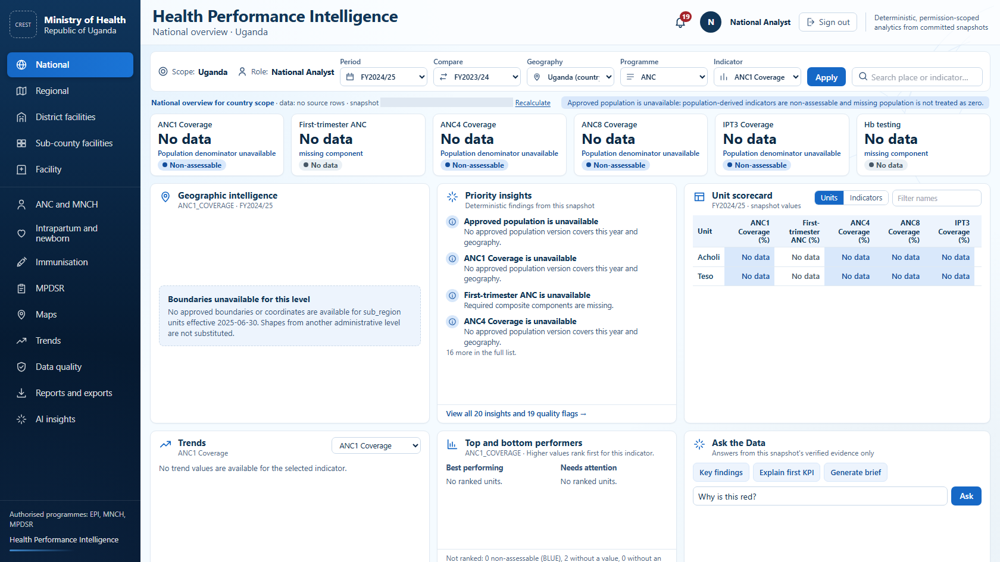
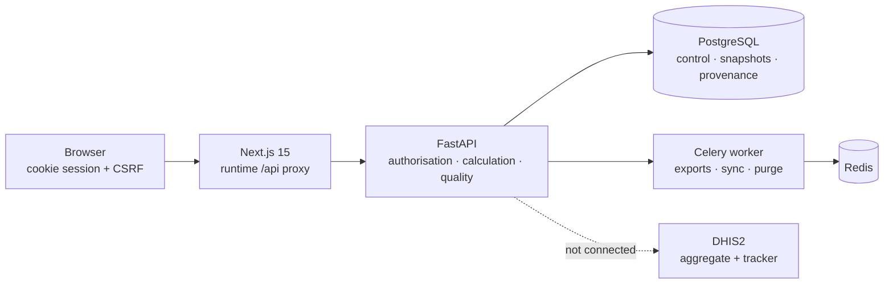

<div align="center">

# Uganda Health Performance Intelligence Platform

**A national analytical layer above DHIS2** — deterministic indicators, permission-scoped
dashboards, maps, data-quality diagnostics, evidence-bound AI interpretation and
publication-ready exports.

First production module: **MNCH** — antenatal care · intrapartum and newborn · immunisation/EPI · MPDSR

[](https://github.com/Isaac25-lgtm/HEALTH-ANALYTICS/actions/workflows/ci.yml)


</div>

> [!IMPORTANT]
> **Pre-UAT — nothing is deployed and nothing is owner-accepted.**
> Phases 1–7 and four corrective passes are implemented and verified locally. Live DHIS2 is not
> connected, no production population or boundary is activated, and no real user exists. Passing
> tests are not acceptance. Outstanding owner inputs are tracked in
> [`OPEN_ITEMS.md`](docs/project-context/OPEN_ITEMS.md).

<div align="center">



<sub>National overview at 1680×945, rendered from a committed snapshot of synthetic development
fixtures. Values read “No data” because no approved population or live data exists yet — the
platform never fabricates a number.</sub>

</div>

---

## Contents

[What it does](#what-it-does) · [Architecture](#architecture) · [Stack](#stack) ·
[Repository layout](#repository-layout) · [Quick start](#quick-start) ·
[Verification](#verification) · [Governance rules](#governance-rules) ·
[Documentation](#documentation) · [Phase status](#phase-status) · [Licence](#licence)

---

## What it does

| | Capability | Behaviour |
|---|---|---|
| 🔢 | **Deterministic calculation** | Every value comes from a versioned formula, a recorded population version and a committed calculation snapshot. The browser never calculates. |
| 🔐 | **Three-dimensional authorisation** | Geography × programme × action, enforced server-side on every request. Changing a URL never widens access. |
| ⭕ | **Honest missing data** | Missing stays missing. Nothing is silently capped, imputed or turned into zero; every unavailable value carries a reason code. |
| 🩺 | **Data quality** | Completeness, consistency, outlier and lineage checks, an explicit flag console, and “why is this red?” drill-down. |
| 🗺️ | **Maps** | MapLibre rendering of permission-filtered server geometry only. Boundaries are never substituted from another level. |
| 🤖 | **Evidence-bound AI** | AI interprets a verified evidence package and never invents numbers. A deterministic fallback answers when no provider is configured. |
| 📤 | **Publishing** | Snapshot-bound Excel, PowerPoint and narrative artifacts through a durable queue with bounded retries and expiring artifacts. |
| 🛡️ | **MPDSR minimisation** | Structured cause codes only — no free text — with strict formats, short retention and suppression below an approved minimum cell count. |

## Architecture



The frontend is served same-origin: the production build contains **no** backend address, and the
`/api` route resolves the backend at request time. Authentication is cookie-only — the browser
never stores a token. PostgreSQL holds control, configuration, snapshot and provenance data, not a
copy of DHIS2.

## Stack

| Layer | Choice |
|---|---|
| **API** | FastAPI · SQLAlchemy 2 · Alembic (head `0012_population_staging_identity`) |
| **Workers** | Celery on Redis — queues for exports, sync and maintenance |
| **Web** | Next.js 15 (App Router) · React 19 · TypeScript · MapLibre |
| **Tests** | pytest (SQLite + PostgreSQL 18) · Vitest · Playwright behind a bounded acceptance gate |
| **Hosting target** | Render blueprint (public web, private API, worker, Key Value, purge cron) with Neon PostgreSQL — defined, **not yet validated by Render** |

## Repository layout

| Path | Role |
|---|---|
| [`backend/`](backend) | API, domain services, models, Alembic migrations, tests |
| [`frontend/`](frontend) | Next.js application, Playwright suite, acceptance gate |
| [`docs/architecture/`](docs/architecture) | Architecture, schema, auth, engines, operations, local development |
| [`docs/project-context/`](docs/project-context) | Binding product context, decisions, defects, open items |
| [`docs/reconciliation/`](docs/reconciliation) | Population workbook and boundary reconciliation reports |
| [`docs/evidence/`](docs/evidence) | Acceptance screenshots and the visual comparison matrix |
| [`render.yaml`](render.yaml) · `docker-compose*.yml` | Deployment blueprint and local stacks |
| `ULTIMATE_IDE_HANDOFF_*.md` · [`AGENTS.md`](AGENTS.md) | Canonical specification and working rules |

## Quick start

<details open>
<summary><b>API</b></summary>

```bash
cd backend
python -m venv .venv && .venv/Scripts/activate      # Linux/macOS: source .venv/bin/activate
pip install -e ".[dev,worker]"
alembic upgrade head
python scripts/bootstrap_reference_data.py          # approved reference configuration
python scripts/create_initial_admin.py              # reads HPIP_ADMIN_PASSWORD once
uvicorn app.main:app --reload
```

</details>

<details open>
<summary><b>Web</b></summary>

```bash
cd frontend
npm ci
npm run dev
```

</details>

Full instructions — including the disposable PostgreSQL cluster and Playwright setup — are in
[`LOCAL_DEVELOPMENT.md`](docs/architecture/LOCAL_DEVELOPMENT.md).

## Verification

```bash
# Backend
python -m ruff check app tests scripts alembic
python -m pytest -q -rs

# Frontend
npm run typecheck && npm run lint && npm test && npm run build
npm run verify:proxy     # proves no backend address is baked into the build
npm run e2e              # bounded acceptance gate
```

`npm run e2e` owns the build, the disposable API, the production web server and Playwright as direct
children. It fails unless every test passes with no skips, Playwright exits by itself within a bound
of its summary, ports 3000/8010 are free, no process created by the run survives, the JSON report is
fresh, process verification succeeded, and the working tree’s status and content fingerprint are
unchanged by the run. Every bound — post-summary, pre-summary inactivity, overall runtime, build,
service stop and each process query — is configurable and fails closed.

<div align="center">

**Latest local results · Windows workstation · 2026-09-16**

| Suite | Result |
|:---|:---|
| Backend — SQLite | **770 passed**, 32 skipped <sub>(30 PostgreSQL-only, 2 Redis)</sub> |
| Backend — PostgreSQL 18 | **800 passed**, 2 skipped <sub>(Redis)</sub> |
| Frontend unit — Vitest | **103 passed** |
| End-to-end — Playwright gate | **24 passed**, 0 skipped, 0 flaky |

</div>

CI additionally runs the backend against PostgreSQL and Redis, the frontend build and Playwright,
and container/compose validation — see [`ci.yml`](.github/workflows/ci.yml).

## Governance rules

Enforced in code and tests, not merely documented:

- **No invention.** Formulas, thresholds, populations, DHIS2 UIDs, mappings and branding are never
  guessed. Gaps are recorded as open items and fail closed.
- **Bootstrap integrity.** Reference bootstrap compares every field it owns and refuses to write on
  any conflict.
- **Boundary activation** requires an approved hierarchy, a recorded mapping decision, a checksum and
  an effective-date approval reference. Against the development fixtures the district source reports
  `reconciliation_unmatched = 143`, `non_production_candidates = 3` and `production_unresolved = 146`;
  sub-counties report `production_unresolved = 2,190`.
- **Populations** can be staged for review but never become denominators without approval.
- **Immutability and audit.** Historical migrations never change; configuration changes are audited
  with before and after values.

## Documentation

| Document | Contents |
|---|---|
| [`OPEN_ITEMS.md`](docs/project-context/OPEN_ITEMS.md) | Owner inputs still required |
| [`DECISION_REGISTER.md`](docs/project-context/DECISION_REGISTER.md) | Owner decisions, kept separate from engineering choices |
| [`DEFECT_MATRIX.md`](docs/project-context/DEFECT_MATRIX.md) | Audited defects, corrections and evidence |
| [`CHANGELOG_CONTEXT.md`](docs/project-context/CHANGELOG_CONTEXT.md) | What changed, with verification results |
| [`DEPLOYMENT.md`](docs/DEPLOYMENT.md) | Render + Neon runbook, retention, backup, rotation |
| [`UI_VISUAL_CONTRACT.md`](docs/project-context/UI_VISUAL_CONTRACT.md) | Visual and interaction contract |

## Phase status

| | Phase | State |
|:--:|---|---|
| ✅ | **1 · Foundations and security** | Cookie/CSRF/JTI sessions, fail-closed production validation. Owner acceptance required. |
| ✅ | **2 · Connectors, geography, population, calculation, quality** | Implemented. Live DHIS2 and approved populations pending. |
| ✅ | **3 · MNCH analytical modules** | Implemented against independent verified fixtures. EPI colour bands undecided. |
| ✅ | **4 · Dashboards and maps** | Implemented per screen and workspace. Source GeoJSON remains unimported. |
| ✅ | **5 · AI** | Deterministic fallback and exact-snapshot evidence. No approved provider configured. |
| ✅ | **6 · Publishing** | Queued Excel/PPTX/report artifacts with durable failure states. Official templates pending. |
| ✅ | **7 · Hardening** | CI, retention purge, Render blueprint, acceptance gate. Blueprint not validated by Render. |
| ⏳ | **UAT** | Blocked on owner inputs, Render/Neon validation and visual acceptance. |

## Not connected

Live DHIS2 (`https://hmis.health.go.ug`) is known but not connected: credentials, metadata mappings
and authenticated synchronisation are unavailable, and `DHIS2_ENABLED=false`. Any credential
disclosed in earlier working material is treated as compromised and is never used.

## Licence

No licence has been declared. All rights reserved by the project owner — please ask before reuse.
