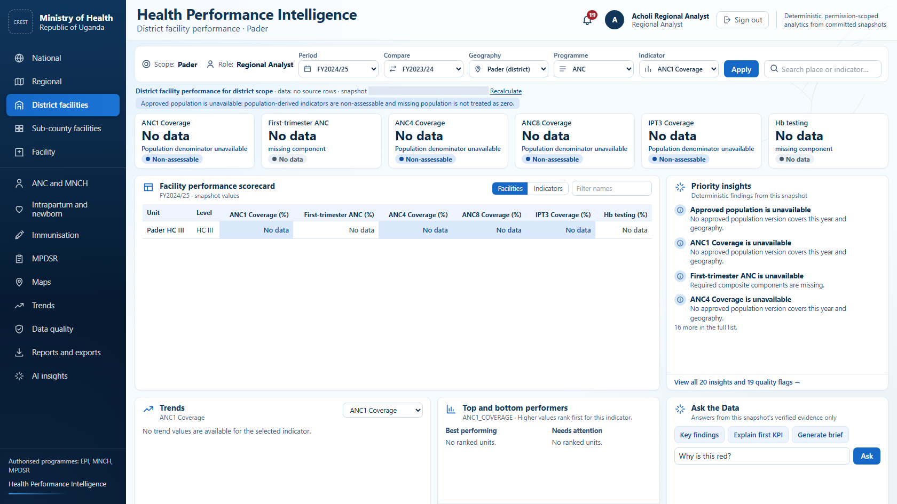
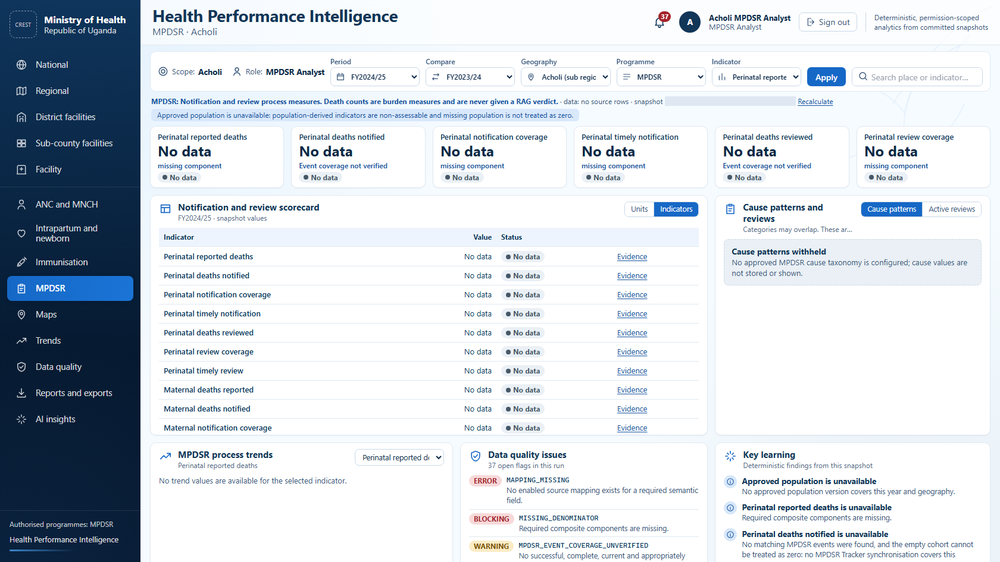
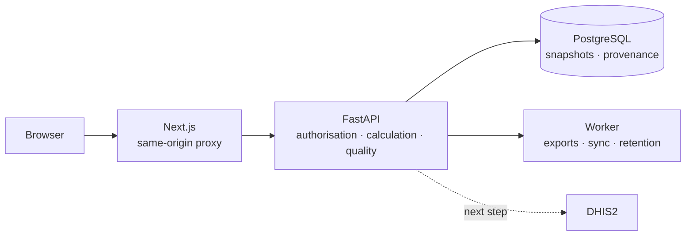

<div align="center">

# Uganda Health Performance Intelligence Platform

### One trusted view of maternal, newborn and child health — from the national picture to a single health centre.

Turns routine DHIS2 reporting into decisions: who is falling behind, by how much,
and what the evidence actually supports.


[](https://github.com/Isaac25-lgtm/HEALTH-ANALYTICS/actions/workflows/ci.yml)


</div>

---

## The problem

Uganda's health system already collects the data. The difficulty is getting a straight answer out of it.

- **The same indicator, three different numbers.** National, district and partner teams each rebuild
  coverage in their own spreadsheet, with their own denominator. Meetings start by arguing about whose
  figure is right.
- **Blank is treated as zero.** A facility that reported nothing looks identical to a facility that
  reported no maternal deaths — so a reporting failure quietly becomes a clean bill of health.
- **The analysis arrives after the decision.** Assembling a quarterly review takes days of copying,
  pasting and re-checking, by which time the quarter has moved on.
- **"Why is this red?" has no answer.** A number on a slide can rarely be traced back to the facility,
  the period or the formula that produced it.

## What it does

| | |
|---|---|
| **One number, everywhere** | Every indicator is calculated once by the server from a versioned formula and an approved population, then reused by every screen, export and report. The browser never recalculates. |
| **Straight to the weak spot** | Ranked districts and facilities, priority insights and red/amber/green scorecards show where attention is needed — not just that the average slipped. |
| **Missing stays missing** | An unavailable value says so, and says why: no approved denominator, a missing component, a stale extract. It is never rounded down to zero. |
| **Answers you can defend** | Every figure carries its formula version, population version, period and calculation run, so "why is this red?" ends in evidence, not opinion. |
| **Reports without the weekend** | Excel, PowerPoint and narrative reports are generated from the exact snapshot on screen. |
| **AI that stays honest** | The assistant explains and summarises only the verified evidence package it is given. It cannot invent a number, and it works without an AI provider at all. |
| **MPDSR handled with care** | Death review data is minimised: structured cause codes only, no free text, short retention and suppression of small counts. |

## Who it is for

| Role | What they get on login |
|---|---|
| **National programme manager** | The country picture, regional comparison, and the districts that need attention this period |
| **Regional / district health team** | Their own district and its facilities, ranked, with the data-quality issues behind the numbers |
| **Facility in-charge** | One facility profile: coverage, trends, and what is missing from their own reporting |
| **MPDSR committee** | Notification and review performance, with confidentiality preserved by design |
| **Data-quality officer** | A console of flags — completeness, outliers, mismatches — instead of a hunt through spreadsheets |

Each person lands on the highest level they are authorised to see, and can only ever drill into what
they are permitted to see. Permissions are enforced on the server, not hidden in the interface.

## A look inside

| District facility performance | MPDSR |
|---|---|
|  |  |

<sub>Screens are rendered from a committed snapshot of synthetic development data. Where a value is
unavailable, the platform says so rather than showing a zero.</sub>

## Under the hood

A FastAPI service calculates and authorises; a Next.js application presents. The browser talks only
to its own origin, and the API is never exposed directly.



Built to extend: the same engine is intended to carry malaria, HIV, TB, nutrition and reporting
performance once MNCH is live.

## Where it stands

This is a working build under active development, running on synthetic data.

- ✅ Analytics, dashboards, maps, quality engine, exports, AI layer and administration are implemented
  and covered by automated tests on every push.
- 🔜 **Next:** connect live DHIS2, load the approved population and boundary sets, and run user
  acceptance testing with the Ministry.
- ⚠️ Not deployed, not connected to live data, and not yet accepted by the owner. Nothing here should
  be read as an official Ministry of Health product.

## For developers

<details>
<summary>Quick start, tests and documentation</summary>

```bash
# API
cd backend
python -m venv .venv && .venv/Scripts/activate      # Linux/macOS: source .venv/bin/activate
pip install -e ".[dev,worker]"
alembic upgrade head
python scripts/bootstrap_reference_data.py
python scripts/create_initial_admin.py              # reads HPIP_ADMIN_PASSWORD once
uvicorn app.main:app --reload

# Web
cd frontend
npm ci
npm run dev
```

Checks: `ruff check app tests scripts alembic` and `pytest -q` for the API; `npm run typecheck`,
`npm run lint`, `npm test`, `npm run build`, `npm run verify:proxy` and `npm run e2e` for the web
application. `npm run e2e` is a bounded acceptance gate: it fails unless every browser test passes,
the runner exits by itself, the service ports are released, no process it started survives, and the
working tree is untouched.

Stack: FastAPI · SQLAlchemy · Alembic · Celery/Redis · Next.js 15 · React 19 · TypeScript · MapLibre ·
PostgreSQL 18. Deployment blueprint for Render + Neon is in [`render.yaml`](render.yaml).

Documentation: [architecture](docs/architecture) ·
[local development](docs/architecture/LOCAL_DEVELOPMENT.md) ·
[deployment](docs/DEPLOYMENT.md) ·
[open decisions](docs/project-context/OPEN_ITEMS.md) ·
[change log](docs/project-context/CHANGELOG_CONTEXT.md)

</details>

## Licence

No licence has been declared. All rights reserved by the project owner — please ask before reuse.
